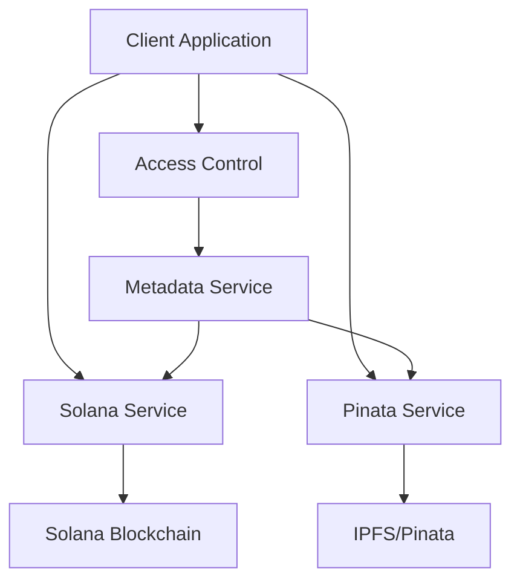

# MedBlock Backend Services Documentation

## Overview
MedBlock's backend services provide a robust infrastructure for handling medical records as NFTs on the Solana blockchain. The system implements secure storage, access control, and blockchain integration for medical records.

## Core Services

### 1. [Solana Service](./solana-service.md)
Handles all blockchain interactions including NFT minting and retrieval.

### 2. [Pinata Service](./pinata-service.md)
Manages decentralized storage using IPFS via Pinata.

### 3. [Metadata Service](./metadata-service.md)
Handles NFT metadata management and retrieval.

### 4. [Access Control Service](./access-control-service.md)
Manages permissions and access control for medical records.

### 5. [Encryption Service](./encryption-service.md)
Handles data encryption (deprecated in favor of Pinata's private storage).

### 6. [API Routes](../api/api-routes.md)
REST API endpoints for interacting with the backend services.

## Architecture Overview



## Service Interactions

1. When a medical report is uploaded:
   - File is stored on IPFS via Pinata Service
   - Metadata is created and stored via Metadata Service
   - NFT is minted via Solana Service
   - Access permissions are set via Access Control Service

2. When accessing a medical report:
   - Access permissions are verified via Access Control Service
   - NFT metadata is retrieved via Metadata Service
   - Medical report is fetched from IPFS via Pinata Service

## Environment Configuration

The services require the following environment variables:

```env
# Solana Configuration
NEXT_PUBLIC_SOLANA_SECRET_KEY=[your-solana-wallet-private-key]
RPC_URL=https://api.devnet.solana.com

# Pinata Configuration
PINATA_API_KEY=your-pinata-api-key
PINATA_SECRET_API_KEY=your-pinata-secret-api-key
```

## Security Considerations

- All sensitive data is stored on Pinata's private IPFS network
- Access control is managed through wallet addresses
- Encryption service is deprecated in favor of Pinata's built-in privacy features
- NFT metadata contains only non-sensitive information

## Error Handling

Each service implements comprehensive error handling with:
- Detailed error logging
- Retry mechanisms for network operations
- Graceful fallbacks for failed operations
- Consistent error response formats

## Best Practices

1. Always verify wallet ownership before granting access
2. Implement rate limiting for API endpoints
3. Monitor blockchain transaction confirmations
4. Keep sensitive data off-chain
5. Implement proper error handling and logging