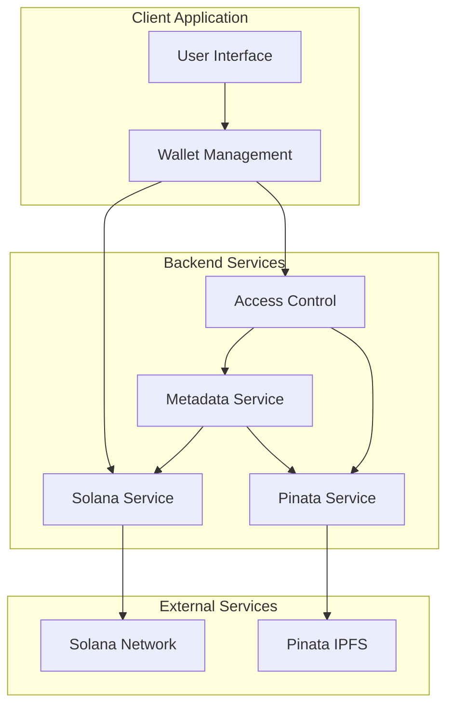
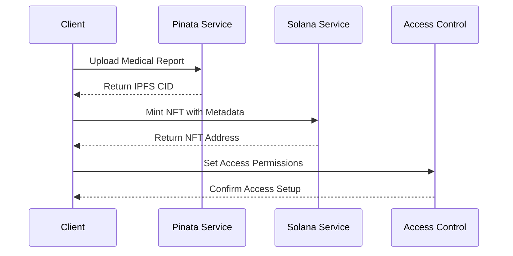
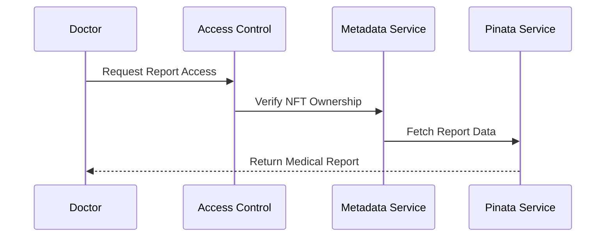

# MedBlock Technical Architecture

## System Overview

MedBlock is a decentralized medical records management system built on the Solana blockchain. The system uses NFTs to represent medical records, with the actual medical data stored securely on IPFS through Pinata's private storage.

## Architecture Diagram

## Service Interactions

### Upload Flow
1. **Client** → **Pinata Service**
   - Uploads medical report file
   - Receives IPFS CID

2. **Client** → **Metadata Service**
   - Creates NFT metadata
   - Links to IPFS file

3. **Client** → **Solana Service**
   - Mints NFT with metadata
   - Records ownership

4. **Client** → **Access Control**
   - Sets initial access permissions
   - Manages doctor authorizations

### Access Flow
1. **Doctor** → **Access Control**
   - Requests access to report
   - Verifies authorization

2. **Access Control** → **Metadata Service**
   - Retrieves NFT metadata
   - Validates ownership

3. **Metadata Service** → **Pinata Service**
   - Fetches medical report
   - Returns to authorized user

## Data Flow

### Medical Record Upload

### Medical Record Access

## Security Architecture

### Authentication Layers
1. **Wallet Authentication**
   - Solana wallet signatures
   - Transaction verification

2. **Access Control**
   - Role-based permissions
   - Granular access control

3. **Data Privacy**
   - Private IPFS storage
   - Encrypted transmission

### Security Measures

#### 1. Blockchain Level
- Solana transaction security
- NFT ownership verification
- Smart contract controls

#### 2. Storage Level
- Private IPFS networks
- Access-controlled gateways
- Encrypted data storage

#### 3. Application Level
- Wallet signature verification
- Role-based access control
- Audit logging

## Performance Considerations

### Optimization Strategies

1. **Blockchain Operations**
   - Batch transactions when possible
   - Implement retry mechanisms
   - Cache NFT metadata

2. **File Storage**
   - Optimize file sizes
   - Use appropriate IPFS gateways
   - Implement lazy loading

3. **Access Control**
   - Cache permission checks
   - Batch permission updates
   - Optimize lookup operations

### Scalability Features

1. **Horizontal Scaling**
   - Stateless service design
   - Load balancer ready
   - Distributed caching support

2. **Resource Management**
   - Connection pooling
   - Rate limiting
   - Request queuing

## Error Handling

### Global Error Categories

1. **Blockchain Errors**
   - Transaction failures
   - Network congestion
   - Wallet interactions

2. **Storage Errors**
   - Upload failures
   - Gateway timeouts
   - Rate limiting

3. **Permission Errors**
   - Access denied
   - Invalid permissions
   - Authorization failures

### Error Recovery Strategies

1. **Automatic Retry**
   - Exponential backoff
   - Circuit breakers
   - Fallback mechanisms

2. **Data Consistency**
   - Transaction validation
   - State reconciliation
   - Integrity checks

## Monitoring and Logging

### Key Metrics

1. **Performance Metrics**
   - Transaction latency
   - Upload speeds
   - Access response times

2. **Security Metrics**
   - Access attempts
   - Permission changes
   - Error rates

3. **Usage Metrics**
   - Active users
   - Storage utilization
   - Network usage

### Logging Strategy

1. **Service Logs**
   - Operation tracking
   - Error reporting
   - Performance monitoring

2. **Audit Logs**
   - Access records
   - Permission changes
   - Data modifications

## Deployment Architecture

### Environment Setup

1. **Development**
   - Local Solana validator
   - IPFS development node
   - Mock services

2. **Staging**
   - Solana testnet
   - Test IPFS network
   - Staging services

3. **Production**
   - Solana mainnet
   - Production IPFS
   - Live services

### Infrastructure Requirements

1. **Compute Resources**
   - Node.js runtime
   - Memory optimization
   - CPU allocation

2. **Network Resources**
   - Load balancing
   - CDN integration
   - Gateway routing

3. **Storage Resources**
   - IPFS pinning
   - Cache layers
   - Backup systems